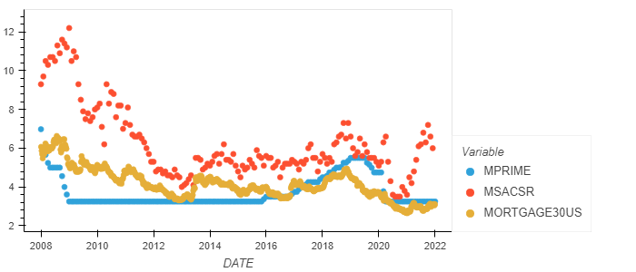
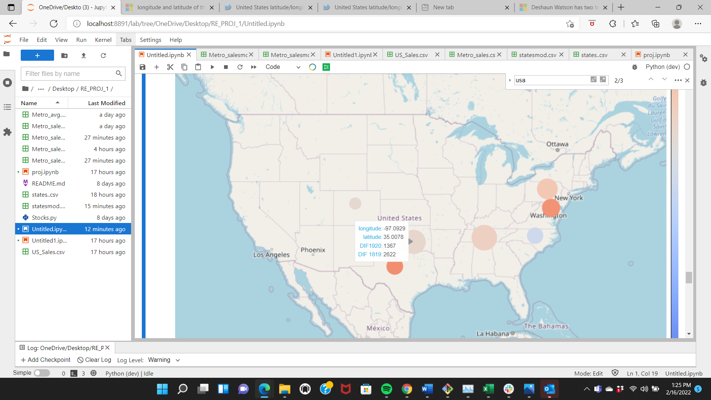

Project Title
The purpose of this program is to help investor to choose correct timing to purchase homes.  The goal is to show  the best time to buy or sell real estate based on FED’S decision to raise or lower interest even though knowing what the FED will do is a bit difficult to know it can be predicted based on history.

Technologies
The code is written in Python 3.7. We imported the following: csv sys fire questionary. We also used a API key for FRED(not provided in this repo) you will need to request your api from Fred(https://fred.stlouisfed.org/docs/api/api_key.html)

Installation Guide

import warnings
warnings.filterwarnings('ignore')

import pandas_datareader as pdr 
import pandas as pd
import requests 
import plotly.express as px
import json
import hvplot.pandas
from datetime import datetime
from pathlib import Path
import numpy as np
%matplotlib inline
from matplotlib import pyplot as plt
import os
from dotenv import load_dotenv
import geopandas
import warnings
warnings.filterwarnings('ignore')
import numpy as np
%matplotlib inline

# How to use the program

Each .ipynb performs a seperate function.

## Final.ipynb- This file runs the graphs and vizulations that compare prime rate. mortgage rates, and housing inventory based anually and shows how the housing invetory reacts to changes in the mortgae rates and prime rates.

## Calcu.ipynb- This file runs a calculator that will the buyer run project mortage payments based on the amount of the loan, down payment, interst rate and length of repayment period 

When running the program pay special attention to notes at the end of each question and press enter after each question

## Untitled.ipynb - runs other grapha that compare intrest rates and sales data that can be used if needed in the presentation

Contributors
In addtion to me the GW Bootcamp TA, LA, and tutors helped Ted, Tawab, and Micheal create this project

License
The Source code is for educational purposes only and should not be used professionally. Feel free to use for any educational needs
